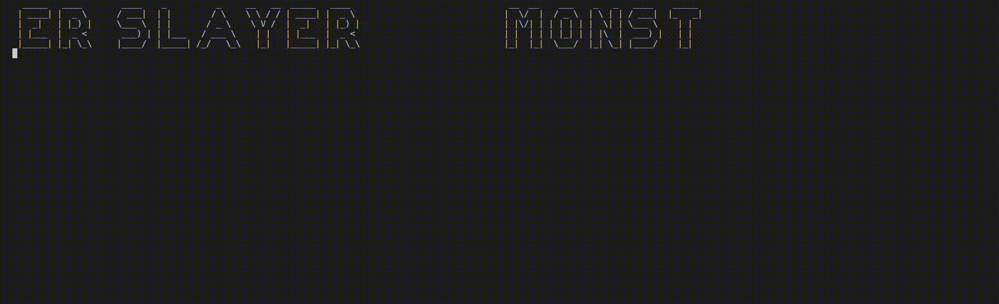

<div align="center" id="top"> 
  

  &#xa0;

  <!-- <a href="https://mastering_go.netlify.app">Demo</a> -->
</div>

<h1 align="center">Mastering_Go</h1>

<p align="center">
  

  

  

  

  <!--  -->

  <!--  -->

  <!--  -->
</p>

<!-- Status -->

<!-- <h4 align="center"> 
	🚧  Mastering_Go 🚀 Under construction...  🚧
</h4> 

<hr> -->

<p align="center">
  <a href="#dart-about">About</a> &#xa0; | &#xa0; 
  <a href="#sparkles-features">Features</a> &#xa0; | &#xa0;
  <a href="#rocket-technologies">Technologies</a> &#xa0; | &#xa0;
  <a href="#white_check_mark-requirements">Requirements</a> &#xa0; | &#xa0;
  <a href="#checkered_flag-starting">Starting</a> &#xa0; | &#xa0;
  <a href="#memo-license">License</a> &#xa0; | &#xa0;
  <a href="https://github.com/johnmerga" target="_blank">Author</a>
</p>

<br>

## About ##

This project was developed to learn the Go language by practice. It is a simple game where you can choose a monster and fight it. and simple BMI calculator.


## Features ##

- [x] BMI Calculator
- [x] Monster Slayer


## Technologies ##

The following tools were used in this project:

- [Go](https://golang.org/)


## Requirements ##

Before starting, you need to have [Go](https://golang.org/) installed

or you can download the executable file the my [releases](v1.0.0) page for both windows and linux.

## Starting ##

```bash
# Clone this project
$ git clone https://github.com/johnmerga/mastering_go

# Access
$ cd mastering_go/monster-slayer

# Install dependencies
$ go get github.com/johnmerga/mastering_go/monster-slayer

# Run the project
$ go run main.go

# the game will start or just run the executable file
```


## License ##

This project is under license from MIT. For more details, see the [LICENSE](LICENSE.md) file.


Made with :heart: by <a href="https://github.com/johnmerga" target="_blank">john merga</a>

&#xa0;

<a href="#top">Back to top</a>
